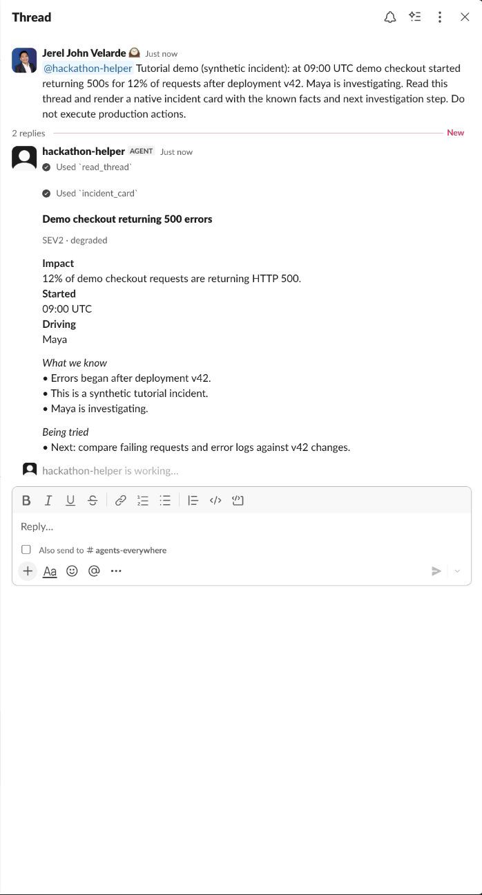
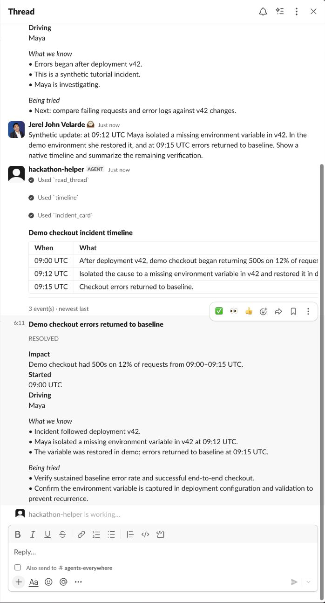

# Slack: from an existing thread to a sourced answer

[Template](../../../templates/slack.md) · [All walkthroughs](../README.md) · [Full account setup with screenshots](../../channels-sdk-walkthrough/README.md)

This guide reuses genuine September 10, 2026 screenshots where the screens match. They prove the earlier Channels setup, native card delivery, and contextual follow-up. They do **not** prove the current Exa research journey; those capture steps are explicitly pending.

## 1. Create the managed Slack Channel

Follow steps 1–4 of the [account setup guide](../../channels-sdk-walkthrough/README.md#1-sign-in-and-create-an-intelligence-project): sign into Intelligence, create a project, create a Channel with Slack, install its Slack app, and complete platform setup. Keep credential fields out of captures.


## 2. Configure and start the template

Put your provider, `CHANNEL_CODE`, `INTELLIGENCE_API_KEY`, and `EXA_API_KEY` settings in root `.env` using the [sponsor guide](../../../using-sponsor-tools.md). The CLI-provisioned `CPK_INTELLIGENCE_API_KEY` must also be copied privately to the `INTELLIGENCE_API_KEY` name this starter reads.

```bash
npm ci
npm run check-env
npm run dev:slack
```

Check **Online**, **Setup complete**, and **Runtime: Connected** in Intelligence. This is connection evidence, not proof of a model response or Exa result.


## 3. Put facts in the thread before mentioning the bot

Use a dedicated demo channel and invite the bot. Post a synthetic incident, then add earlier replies with two facts: rollback did not improve latency, and connection pool wait time increased. Only then mention the bot inside that existing thread:

> Read this thread before suggesting next steps. Show a native incident card. Treat the scenario as synthetic and do not change production.

Verify `read_thread` used the earlier replies. The existing capture below demonstrates native card rendering in the earlier tutorial scenario; it is not a capture of the new two-fact test above.



**Capture pending:** the new thread's earlier facts and the card that accounts for both.

## 4. Research with Exa and inspect the sources

Reply in the same thread:

> Research documented causes of connection-pool saturation and retry storms with Exa. Include source links and distinguish published evidence from facts in our thread. Account for the failed rollback.

Inspect `search_web` in the runtime and open the returned URLs. Confirm the cited pages support the explanation. Public search does not read incident logs or prove a root cause.

**Capture pending:** the Exa-backed answer, visible source links, and one opened supporting page. No existing screenshot is presented as evidence for this step.

## 5. Ask a contextual follow-up without another mention

Reply:

> Given the earlier failed rollback and the sources you found, what should we check next? Keep the answer here and update the card.

Confirm it stays in the same thread and uses both the conversation and source evidence. This earlier real capture demonstrates subscribed-thread follow-up and native timeline/card rendering, without Exa:



**Capture pending:** the full current context → Exa → card → follow-up journey. The older run also logged delivery lifecycle errors; see [its observed limitation](../../channels-sdk-walkthrough/README.md#observed-limitation-and-troubleshooting).
