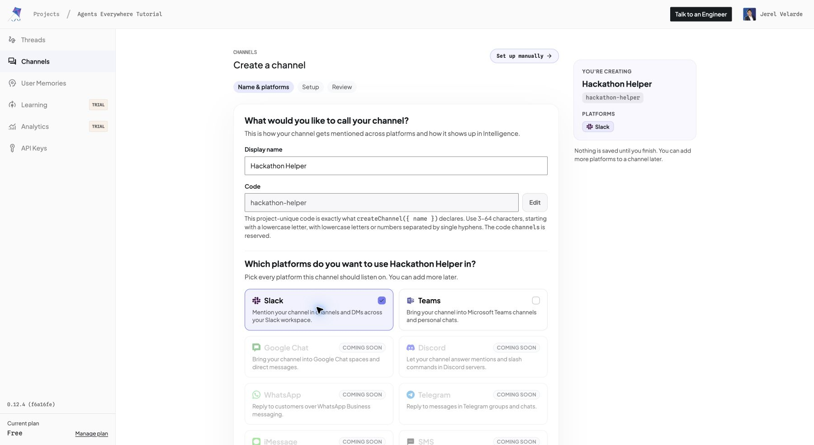
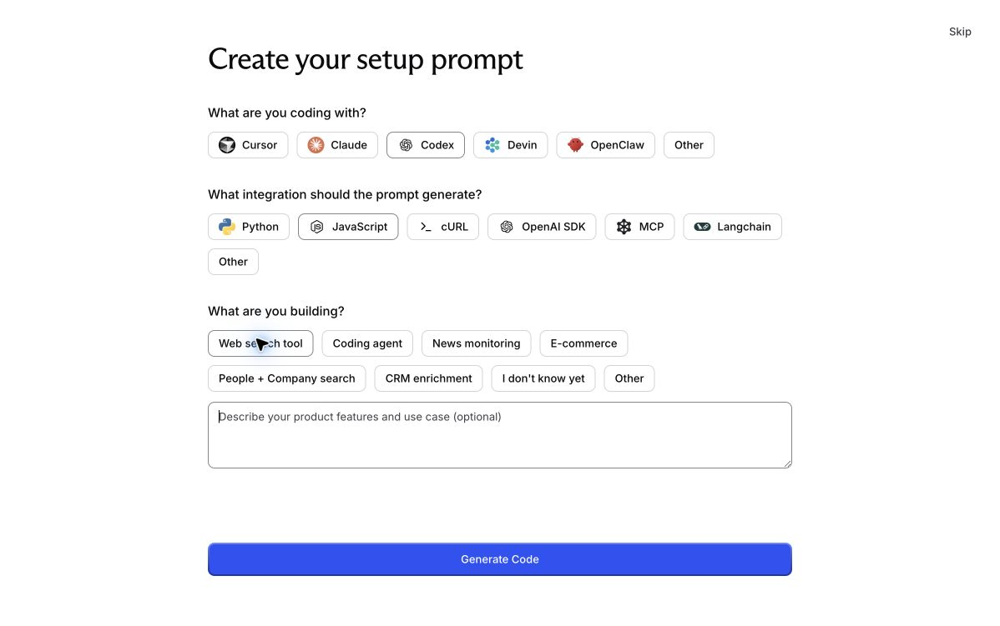
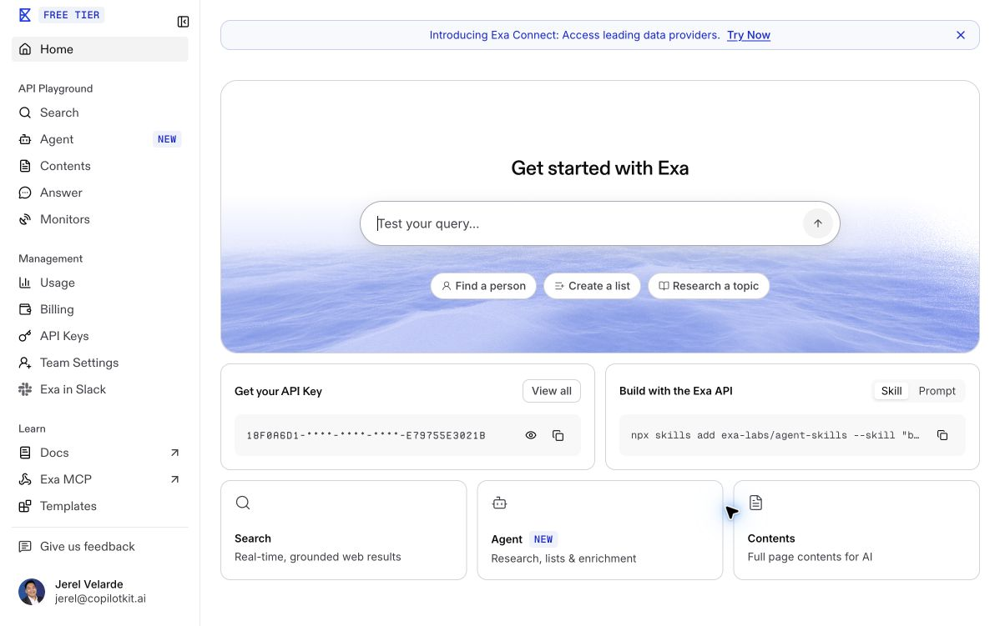
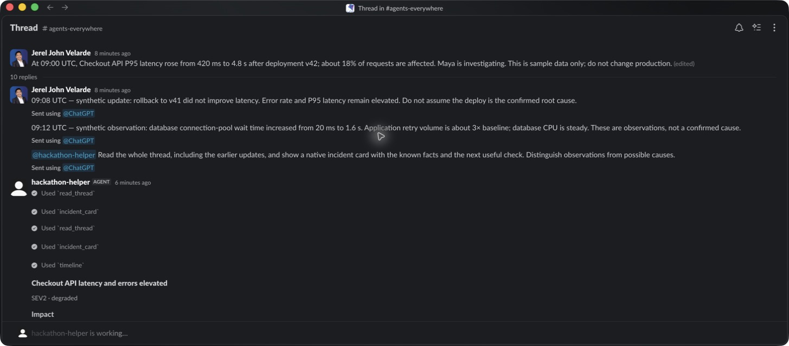
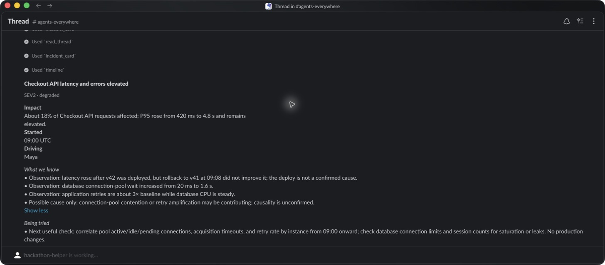
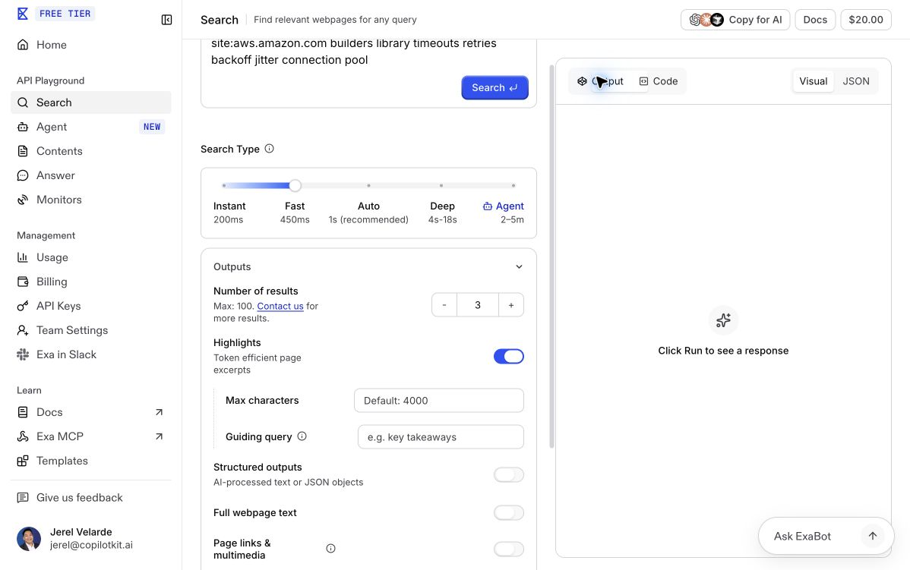
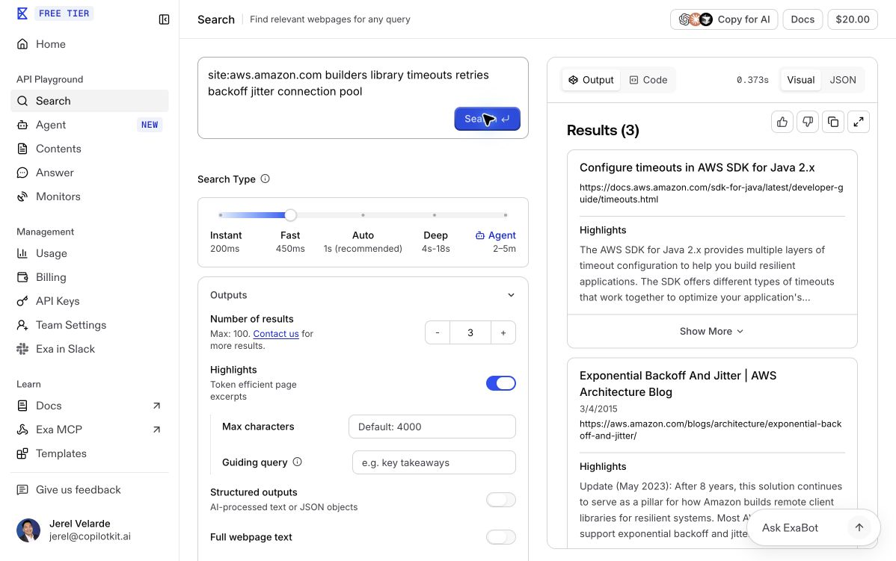
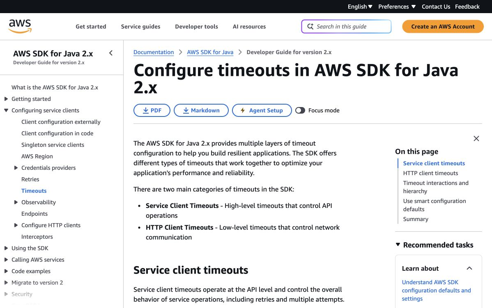
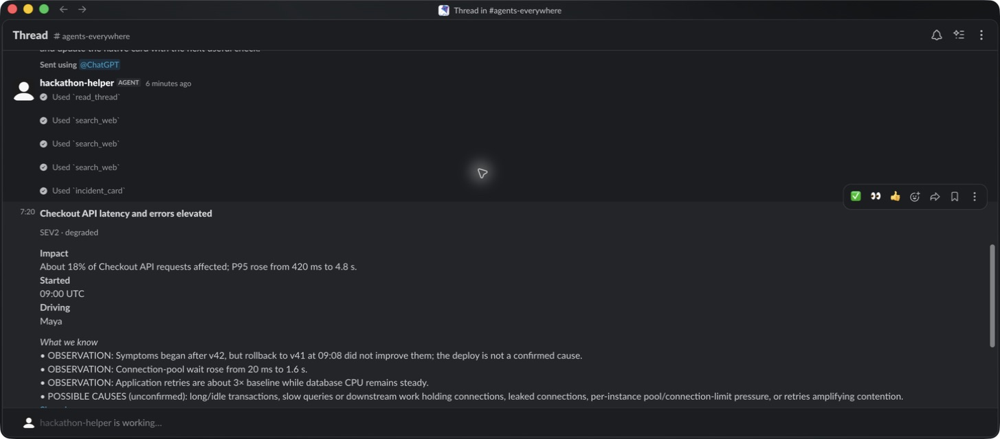
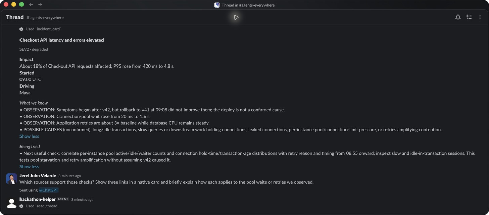

# Slack: from an existing thread to a sourced answer

[Template](../../../templates/slack.md) · [All walkthroughs](../README.md) · [Full account setup with screenshots](../../channels-sdk-walkthrough/README.md)

This guide uses real September 10, 2026 captures for Channels account setup and real September 11 captures for Exa and Slack. The current trial verified authenticated Exa search, earlier thread context, and native card delivery. Source-link delivery in the Slack research reply remains pending.

[Watch the 48-second Slack walkthrough (silent MP4)](videos/slack-thread-walkthrough.mp4). This is a real recording of scrolling the existing test thread: earlier context and the bot mention, the delivered incident card and timeline, and the follow-up without another mention with Exa tool calls. It records the existing thread rather than a fresh agent run. Citation delivery and the lingering working indicator remain unresolved.

## 1. Create the managed Slack Channel

Follow steps 1–4 of the [account setup guide](../../channels-sdk-walkthrough/README.md#1-sign-in-and-create-an-intelligence-project): sign into Intelligence, create a project, create a Channel with Slack, install its Slack app, and complete platform setup. Keep credential fields out of captures.



## 2. Configure and start the template

Sign into your existing [Exa account](https://dashboard.exa.ai/). If the **Create your setup prompt** screen appears, choose **Codex → JavaScript → Web search tool**, then select **Generate Code → Go to Dashboard**. These were the selections used in the live setup trial:



On the dashboard, use **Get your API Key**, or open **Management → API Keys**. The verified account already had a default key. Copy a suitable existing key privately into root `.env` as `EXA_API_KEY`; keep it masked in screenshots. See the [full Exa setup](../../../using-sponsor-tools.md#exa) for the first authenticated search command.



These captures verify account access and configuration choices. Step 4 shows the successful authenticated Exa search; delivery of that research through Slack is a separate check.

Put your provider, `CHANNEL_CODE`, `INTELLIGENCE_API_KEY`, and `EXA_API_KEY` settings in root `.env` using the [sponsor guide](../../../using-sponsor-tools.md). The CLI-provisioned `CPK_INTELLIGENCE_API_KEY` must also be copied privately to the `INTELLIGENCE_API_KEY` name this starter reads.

```bash
npm ci
npm run check-env
npm run dev:slack
```

Check **Online**, **Setup complete**, and **Runtime: Connected** in Intelligence. This is connection evidence, not proof of a model response or Exa result.


## 3. Put facts in the thread before mentioning the bot

Use a dedicated demo channel and invite the bot. Post a synthetic incident, then add earlier replies with two facts: rollback did not improve latency, and connection pool wait time increased. Only then mention the bot inside that existing thread:

> Read the whole thread, including the earlier updates, and show a native incident card with the known facts and the next useful check. Distinguish observations from possible causes.

Verify `read_thread` used the earlier replies. In the approved live test channel, the earlier messages recorded a failed rollback, connection-pool wait increasing from 20 ms to 1.6 s, application retries at about 3× baseline, and steady database CPU.



**Live result:** the bot called `read_thread`, `incident_card`, and `timeline`. Its native card included all those observations and kept causality unconfirmed.



## 4. Research with Exa and inspect the sources

First verify Exa independently. In the dashboard, open **API Playground → Search**, choose **Fast**, set **Number of results** to **3**, and enable **Highlights**. Run the query used in the live trial:

```text
site:aws.amazon.com builders library timeouts retries backoff jitter connection pool
```



**Live result:** the starter’s `searchWeb` capability and the signed-in playground both returned three AWS sources. The visible results include the [AWS SDK for Java timeout guide](https://docs.aws.amazon.com/sdk-for-java/latest/developer-guide/timeouts.html) and [Exponential Backoff And Jitter](https://aws.amazon.com/blogs/architecture/exponential-backoff-and-jitter/). Both supporting pages were opened and checked; search results can change.



Open a returned page and compare its guidance with the question. This actual browser capture records the AWS timeout documentation returned by the independent Exa search.



To use that research inside Slack, reply in the same thread:

> Research documented causes of connection-pool saturation and retry storms with Exa. Include source links, distinguish published guidance from observations in this thread, and account for the failed rollback. Keep the answer concise and update the native card with the next useful check.

Inspect `search_web` in the runtime and open the returned URLs. Confirm the cited pages support the explanation. Public search does not read incident logs or prove a root cause.

**Live result:** the research reply, sent without another mention, triggered `read_thread` and three `search_web` calls. The bot delivered an updated native card with checks for pool usage, transaction age, and retry timing, but omitted the requested source URLs.



**Capture pending:** visible source links in the Slack research answer. The request in the next step had not produced those links by the end of the trial.

## 5. Ask a contextual follow-up without another mention

Reply:

> Which sources support those checks? Show three links in a native card and briefly explain how each applies to the pool waits or retries we observed.

The research reply from step 4 already demonstrated subscribed-thread follow-up: it arrived without another mention and delivered an updated native card that preserved the failed rollback and earlier observations. The screenshot below shows that expanded card and the subsequent request for source links.



**Capture pending:** the requested source links. The later request triggered tools but had not delivered URLs by the end of the trial. Context reuse, Exa invocation, and native follow-up delivery passed; the full sourced-answer journey remains incomplete.

**Observed limitation:** the current Slack trial continued to show **hackathon-helper is working…** after native card delivery, although the observed runtime info output reported no errors. Treat that indicator separately from delivered-card evidence. The older run logged delivery lifecycle errors; see [its observed limitation](../../channels-sdk-walkthrough/README.md#observed-limitation-and-troubleshooting).
