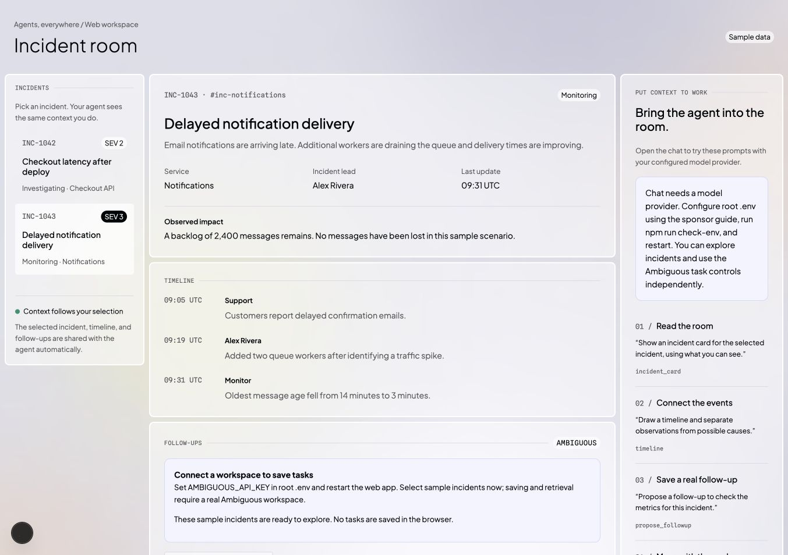
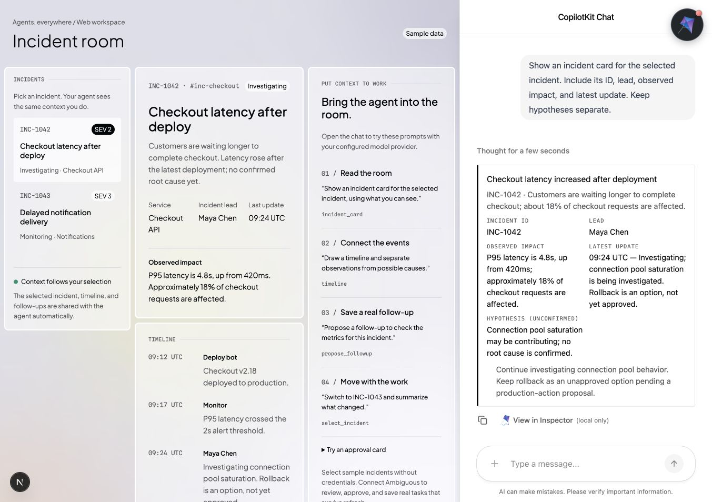
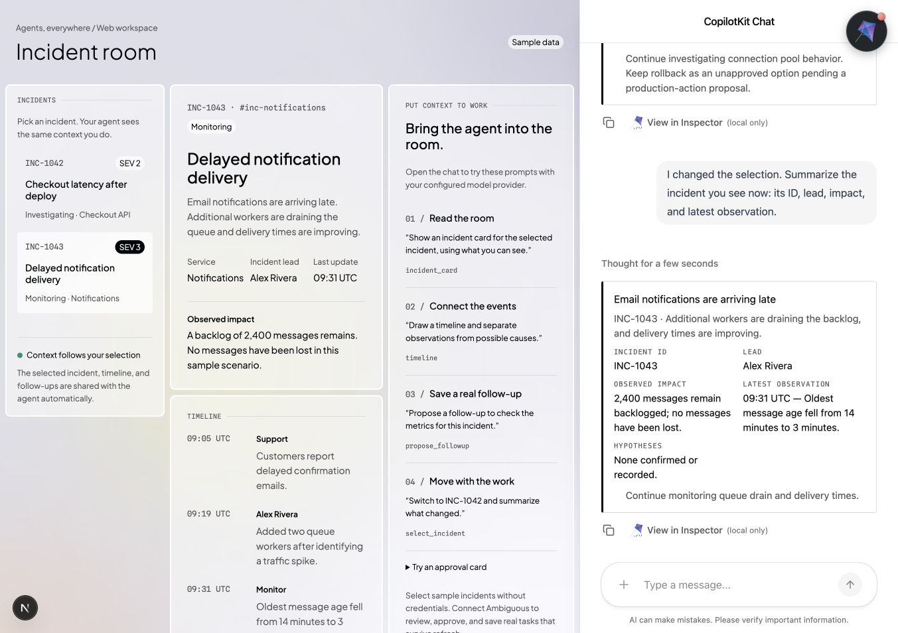
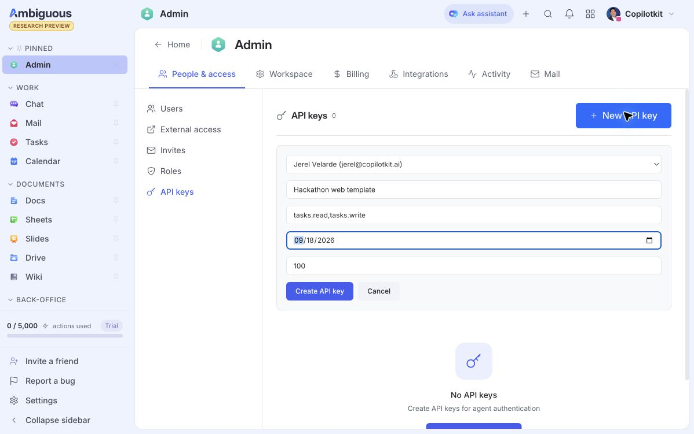
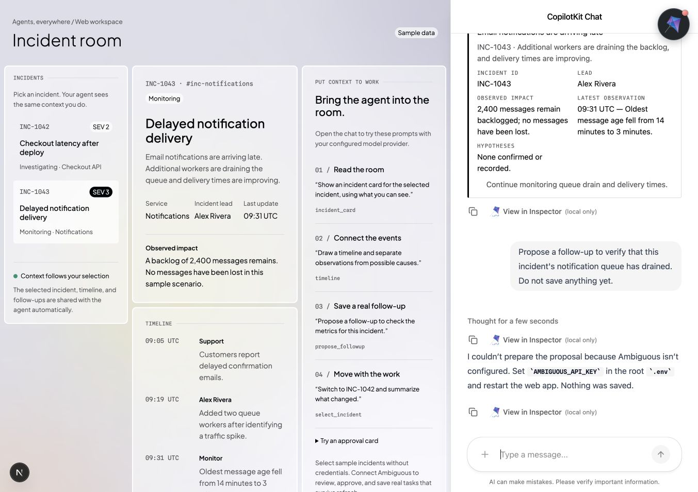
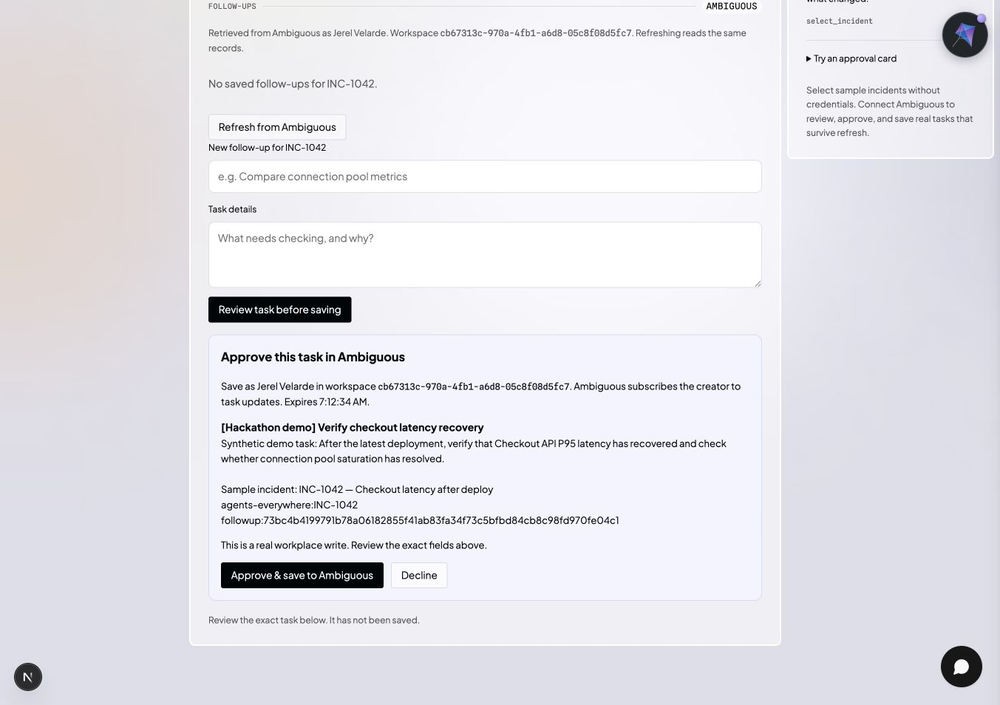
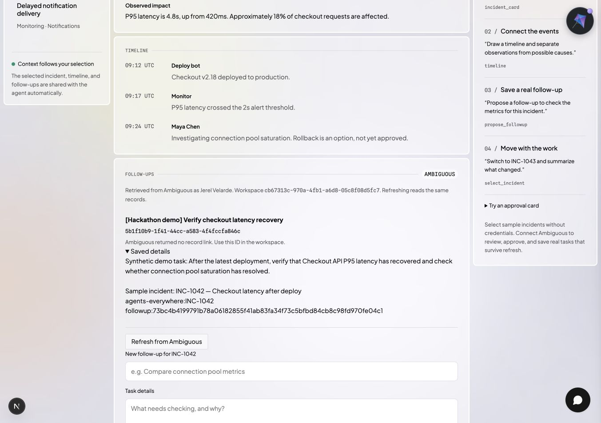
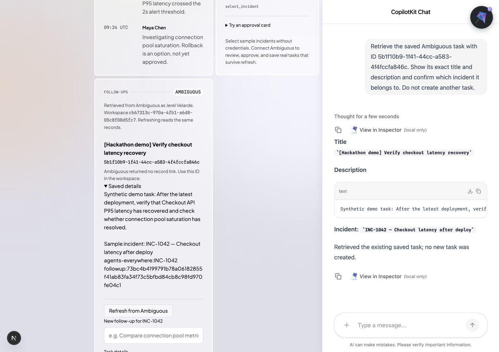
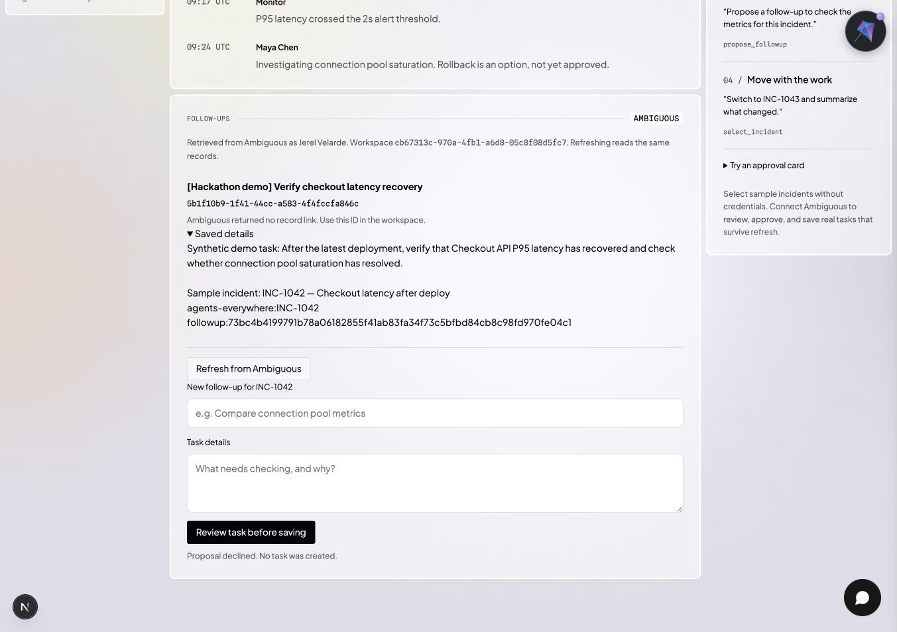

# Web: selected context to an approved workplace task

[Template](../../../templates/web.md) · [All walkthroughs](../README.md) · [Sponsor setup](../../../using-sponsor-tools.md#ambiguous-ai)

Use the sample incident workspace to learn the wiring, then replace the domain with your own workflow. The screenshots below come from a real browser trial on September 11, 2026. The authenticated Ambiguous trial verified review, explicit approval, create/read-back, persistence after a full browser reload, and agent retrieval by the saved ID. Ambiguous returned an actual task ID and no record URL.

## 1. Install and open the sample workspace

```bash
npm ci
npm run dev:web
```

Open `http://localhost:3100`. Select **INC-1043** and inspect the notifications timeline. Without credentials, the page shows model setup instructions and **Connect a workspace to save tasks**. **Review task before saving** stays disabled. Nothing is saved in browser storage.



## 2. Connect a model and ask about the selected record

Configure root `.env` using [OpenAI setup](../../../using-sponsor-tools.md#openai), choose a model available to the account, and restart the app. Select an incident and ask:

> What is happening with the selected incident? Show a card using the page context.

Check the service, facts, and timeline against the page without pasting them into chat. Then ask to switch to the other incident and verify that the visible selection and answer change together.





## 3. Connect the intended Ambiguous workspace

Sign into [Ambiguous](https://app.ambiguous.ai/) and select your existing workspace. The signed-in setup path is **Admin → People & access → API keys → New API key**.

On the new-key screen:

- Select the **User** whose identity the template should use.
- Enter `Hackathon web template` as the **API key name**.
- Replace the default `*` in **Scopes** with `tasks.read,tasks.write`.
- Choose an expiry after your demo; `2026-09-18` is an example for this event. The observed **Rate limit** default is `100`.



This real capture shows a prepared form in the test workspace. **Create API key had not been selected**, and no credential was generated or exposed. Select your own intended workspace identity.

Review the workspace, user, and scope before selecting **Create API key**. If you already have a suitable key stored privately, reuse it. Follow the [full existing-account setup](../../../using-sponsor-tools.md#ambiguous-ai) if the administration page is unavailable. Do not create another workspace to solve an access problem.

Copy the generated value privately into root `.env` as `AMBIGUOUS_API_KEY`, then restart the web app. Exclude the revealed key from screenshots; a safe setup capture shows the form before creation. The navigation and fields above were verified in a signed-in account, but creating a key alone does not verify task persistence.

Run:

```bash
npm run check:workplace --workspace web
npm run check:workplace --workspace web -- --identity
```

The first command verifies the real public MCP schemas without writes. The second reads the authenticated identity. Compare the identity and workspace ID with the intended demo workspace. The page should list real saved follow-ups or show none for the selected incident.

With no workspace key, the real browser trial shows a clear setup message and confirms nothing was saved. This screenshot verifies the missing-configuration path, not persistence.



**Live result:** the identity check passed in the intended workspace as Jerel Velarde. The review screenshot in the next step shows that connected identity and an empty saved-task list before approval.

## 4. Prepare and review a task

Ask:

> Propose a follow-up for the selected incident. Include the known facts and the next useful check.

Or fill in the title/details form and select **Review task before saving**. Inspect the exact title, description, incident markers, workspace ID, and expiry in the approval panel. The proposal has not been saved yet. A chat message saying “approved” does not execute the write.

**Live result:** the real agent called `propose_followup` for `[Hackathon demo] Verify checkout latency recovery`. The review panel showed the exact synthetic task fields, INC-1042 markers, workspace identity, and expiry while the saved-task list remained empty.



## 5. Approve and inspect the actual record

Click **Approve & save to Ambiguous**. The server validates the proposal and discovered input schema, then calls the real task tool. Success requires a read-back with the same ID, title, and description. Open the record link if Ambiguous returns one. If it returns no link, the page says so and shows the actual ID; never invent a URL for the screenshot.

**Live result:** explicit approval created and read back task `5b1f10b9-1f41-44cc-a583-4f4fccfa846c` with the same title and description. The provider returned no URL; the page correctly displays the ID and explains that no record link was returned.



## 6. Refresh and retrieve the same task

Refresh the browser and select the same incident. Verify the task returns from Ambiguous. Ask the agent to retrieve its actual ID, and confirm it returns the same fields without creating another task. The local approval files are metadata only; they cannot substitute for this external read.

**Live result:** a full browser reload retrieved exactly one saved task with the same ID, `5b1f10b9-1f41-44cc-a583-4f4fccfa846c`. The agent then called `retrieve_followup` for that ID and returned the same title, description, and INC-1042 markers without creating another task.



## 7. Try the failure paths

Decline another proposal, then let a separate ten-minute proposal expire. Neither should save. An unavailable credential or permission must produce a visible error. If a create response is lost, refresh to reconcile; the exact action is not blindly sent again.

**Live result:** a separate proposal titled `[Hackathon demo] Declined proposal — do not save` was declined. The page reported that no task was created. Refreshing from Ambiguous still returned exactly the one original approved task.



**Live capture pending:** expiry and an authenticated provider error/recovery. Offline tests cover these boundaries separately in [verification evidence](../../template-validation.md).
